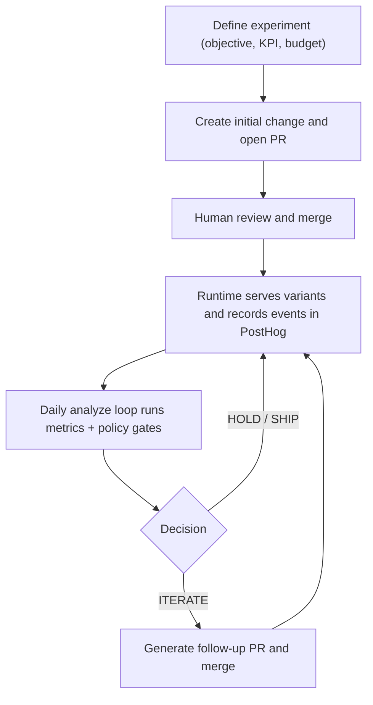

# Flagship

> Disclaimer: Flagship is experimental software. APIs, workflows, and behavior may change without notice, and it is not recommended for production-critical use without independent validation.

Flagship is an **Agent Skill** (`skills/flagship/SKILL.md`) that helps teams run product experiments faster and with less risk by using feature flags and cohort analysis.
Given a budget, an agent using this skill runs the experiment, analyzes cohort results, and keeps the option that performs best.

## High-Level Behavior



## What It Does

Flagship helps you test product ideas without ad-hoc scripts. It combines cohort data from PostHog (via MCP), deterministic safety gates, and Codex-generated treatment updates. The result is a repeatable loop: measure, decide, propose, review, and merge. You keep control through budgets, guardrails, and normal PR review.

## Quick Start (5 minutes)

1. Create a GitHub Environment named `flagship`.
2. Add secrets: `OPENAI_API_KEY`, `POSTHOG_API_KEY`, `POSTHOG_MCP_URL`.
3. Create an experiment in Codex:

   ```text
   Use the flagship skill and create a new flagship experiment for onboarding activation.
   ```

4. Commit the generated files:
   - `.flagship/experiments/<experiment_id>.yaml`
   - `.flagship/state/<experiment_id>.yaml`
5. Generate or update `.github/workflows/flagship-loop.yml` from the template and run it once manually.
6. Review the PR on `codex/flagship/<experiment_id>`, then merge when ready.

### How Data Authority Works

- Use PostHog as source of truth for exposure assignment and experiment results.
- Use repo manifest/state as source of truth for budget, guardrails, and automation state.
- Reuse an existing feature-flag provider when detected in the repo.
- Default to PostHog only when no provider is clearly present.
- Force `HOLD` when critical settings drift between manifest and PostHog.

## Repo Layout

- `.flagship/experiments/`: experiment manifests
- `.flagship/state/`: runtime state per experiment
- `.flagship/reports/`: daily run reports
- `.flagship/ledger/`: decision history
- `.github/workflows/`: scheduled loop workflow

## Daily Loop

- Validate manifest and state.
- Read cohort metrics through PostHog MCP.
- Evaluate policy gates (sample size, guardrails, budget).
- Propose treatment iteration only when final action is `ITERATE`.
- Write report + ledger entry and open/update the PR.

## Workflow Diagrams

- Create + initial A/B code PR: `docs/diagrams/01-create-and-initial-pr.md`
- Live runtime cohort routing: `docs/diagrams/02-live-runtime-cohorts.md`
- GitHub Actions analyze loop: `docs/diagrams/03-github-actions-analyze-loop.md`
- Iterate PR loop: `docs/diagrams/04-iterate-pr-loop.md`

## Minimal Experiment Spec

Use small manifests in README and keep full schema details in references.

```yaml
# .flagship/experiments/onboarding-copy-v1.yaml
experiment_id: onboarding-copy-v1
primary_kpi: activation_24h_rate
max_budget_usd: 1000
feature_flag:
  provider: posthog
  key: onboarding.copy_variant
status: active
```

```yaml
# .flagship/state/onboarding-copy-v1.yaml
spent_usd_total: 0
budget_remaining_usd: 1000
last_decision: HOLD
open_pr_number: null
```

## Safety Rules

- Keep `objective`, `primary_kpi`, and `max_budget_usd` immutable after creation.
- Stop immediately when budget remaining is `<= 0`.
- Hold when sample size is insufficient or any guardrail fails.
- Ship repository changes through PRs only.
- Track each run in reports and ledger for auditability.

## References

- Skill workflow: `skills/flagship/SKILL.md`
- Experiment schema: `skills/flagship/references/experiment-schema.md`
- Policy gates: `skills/flagship/references/policy-gates.md`
- PostHog MCP queries: `skills/flagship/references/posthog-mcp-queries.md`
- Provider + hybrid model: `skills/flagship/references/provider-and-hybrid.md`
- Advanced local scripts: `skills/flagship/scripts/`
