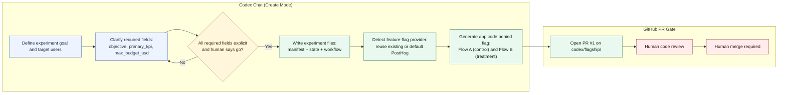

# Create Mode: Initial A/B Code Generation

```mermaid
flowchart LR
  subgraph CHAT["Codex Chat (Create Mode)"]
    A["Define experiment goal and target users"]:::step --> B["Clarify required fields:<br/>objective, primary_kpi, max_budget_usd"]:::step
    B --> C{"All required fields explicit<br/>and human says go?"}:::decision
    C -- "No" --> B
    C -- "Yes" --> D["Write experiment files:<br/>manifest + state + workflow"]:::action
    D --> E["Detect feature-flag provider:<br/>reuse existing or default PostHog"]:::action
    E --> F["Generate app code behind flag:<br/>Flow A (control) and Flow B (treatment)"]:::action
  end

  subgraph GIT["GitHub PR Gate"]
    G["Open PR #1 on codex/flagship/<experiment_id>"]:::action --> H["Human code review"]:::human
    H --> I["Human merge required"]:::human
  end

  F --> G

  classDef step fill:#eef4ff,stroke:#4a6fa5,stroke-width:1px,color:#1f2d3d;
  classDef action fill:#eaf9ef,stroke:#3d7a57,stroke-width:1px,color:#102217;
  classDef decision fill:#fff6db,stroke:#9a7b24,stroke-width:1px,color:#3b2f0d;
  classDef human fill:#ffeceb,stroke:#a44b4b,stroke-width:1px,color:#3a1414;
```
