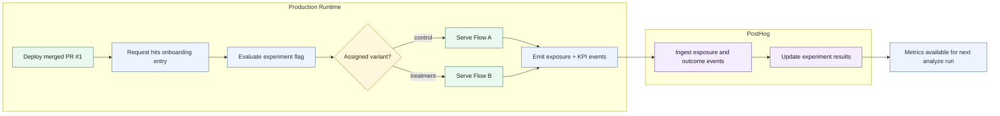

# Live Experiment Runtime

```mermaid
flowchart LR
  subgraph PROD["Production Runtime"]
    A["Deploy merged PR #1"]:::action --> B["Request hits onboarding entry"]:::step
    B --> C["Evaluate experiment flag"]:::step
    C --> D{"Assigned variant?"}:::decision
    D -- "control" --> E["Serve Flow A"]:::action
    D -- "treatment" --> F["Serve Flow B"]:::action
    E --> G["Emit exposure + KPI events"]:::step
    F --> G
  end

  subgraph PH["PostHog"]
    H["Ingest exposure and outcome events"]:::data --> I["Update experiment results"]:::data
  end

  G --> H
  I --> J["Metrics available for next analyze run"]:::step

  classDef step fill:#eef4ff,stroke:#4a6fa5,stroke-width:1px,color:#1f2d3d;
  classDef action fill:#eaf9ef,stroke:#3d7a57,stroke-width:1px,color:#102217;
  classDef decision fill:#fff6db,stroke:#9a7b24,stroke-width:1px,color:#3b2f0d;
  classDef data fill:#f4ecff,stroke:#6f4aa5,stroke-width:1px,color:#221237;
```
