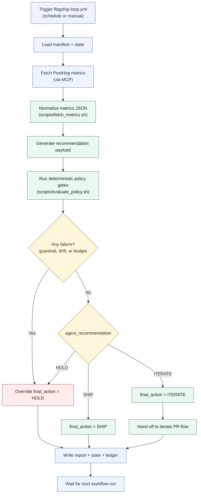

# GitHub Actions Analyze Loop

```mermaid
flowchart TD
  A["Trigger flagship-loop.yml<br/>(schedule or manual)"]:::step --> B["Load manifest + state"]:::step
  B --> C["Fetch PostHog metrics<br/>(via MCP)"]:::step
  C --> D["Normalize metrics JSON<br/>(scripts/fetch_metrics.sh)"]:::action
  D --> E["Generate recommendation payload"]:::action
  E --> F["Run deterministic policy gates<br/>(scripts/evaluate_policy.sh)"]:::action
  F --> G{"Any failure?<br/>guardrail, drift, or budget"}:::decision
  G -- "Yes" --> H["Override final_action = HOLD"]:::danger
  G -- "No" --> I{"agent_recommendation"}:::decision
  I -- "HOLD" --> H
  I -- "SHIP" --> J["final_action = SHIP"]:::action
  I -- "ITERATE" --> K["final_action = ITERATE"]:::action

  H --> L["Write report + state + ledger"]:::step
  J --> L
  K --> M["Hand off to iterate PR flow"]:::action
  M --> L
  L --> N["Wait for next workflow run"]:::step

  classDef step fill:#eef4ff,stroke:#4a6fa5,stroke-width:1px,color:#1f2d3d;
  classDef action fill:#eaf9ef,stroke:#3d7a57,stroke-width:1px,color:#102217;
  classDef decision fill:#fff6db,stroke:#9a7b24,stroke-width:1px,color:#3b2f0d;
  classDef danger fill:#ffeceb,stroke:#a44b4b,stroke-width:1px,color:#3a1414;
```
