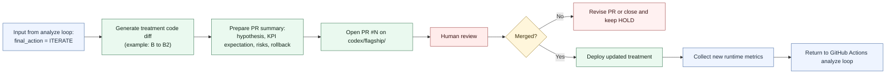

# Iterate Mode: Follow-Up Code Change PR

```mermaid
flowchart LR
  A["Input from analyze loop:<br/>final_action = ITERATE"]:::step --> B["Generate treatment code diff<br/>(example: B to B2)"]:::action
  B --> C["Prepare PR summary:<br/>hypothesis, KPI expectation, risks, rollback"]:::action
  C --> D["Open PR #N on codex/flagship/<experiment_id>"]:::action
  D --> E["Human review"]:::human
  E --> F{"Merged?"}:::decision
  F -- "No" --> G["Revise PR or close and keep HOLD"]:::danger
  F -- "Yes" --> H["Deploy updated treatment"]:::action
  H --> I["Collect new runtime metrics"]:::step
  I --> J["Return to GitHub Actions analyze loop"]:::step

  classDef step fill:#eef4ff,stroke:#4a6fa5,stroke-width:1px,color:#1f2d3d;
  classDef action fill:#eaf9ef,stroke:#3d7a57,stroke-width:1px,color:#102217;
  classDef decision fill:#fff6db,stroke:#9a7b24,stroke-width:1px,color:#3b2f0d;
  classDef human fill:#ffeceb,stroke:#a44b4b,stroke-width:1px,color:#3a1414;
  classDef danger fill:#fff1f1,stroke:#a44b4b,stroke-width:1px,color:#3a1414;
```
